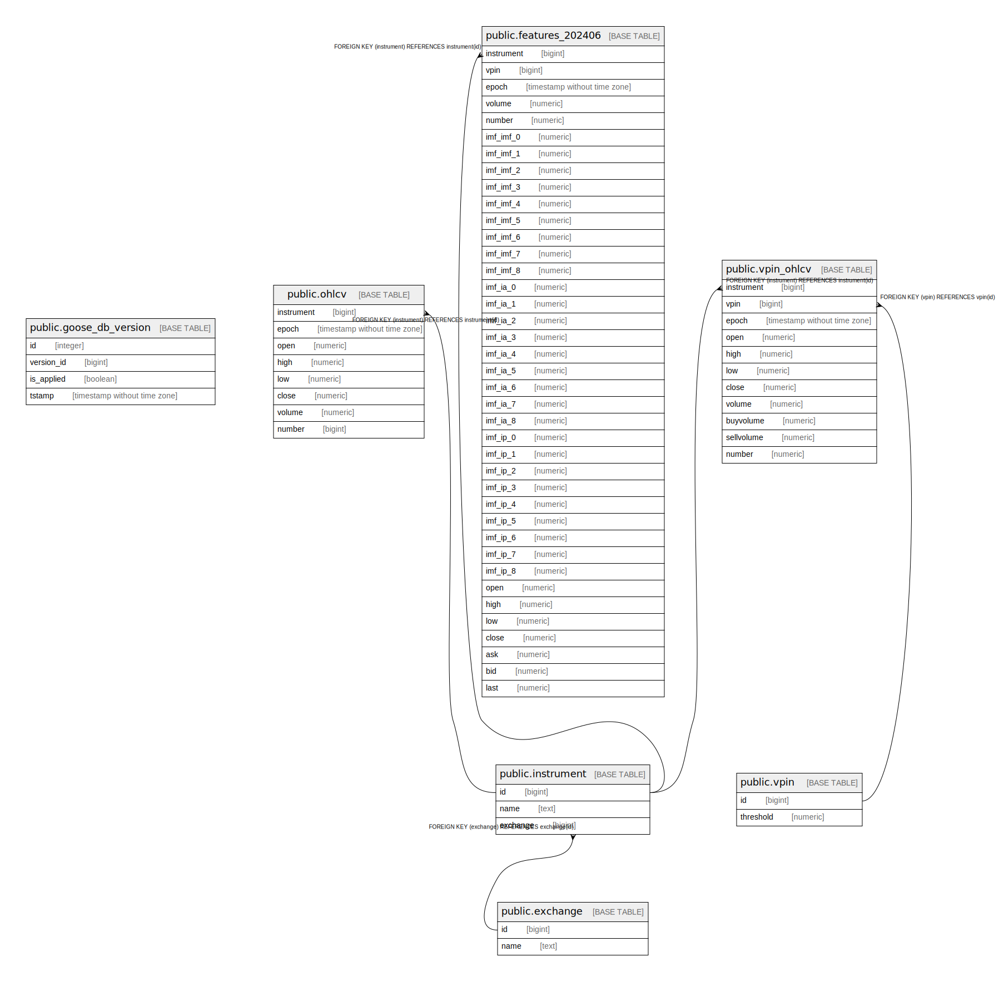

# db

## Tables

| Name | Columns | Comment | Type |
| ---- | ------- | ------- | ---- |
| [public.goose_db_version](public.goose_db_version.md) | 4 |  | BASE TABLE |
| [public.exchange](public.exchange.md) | 2 |  | BASE TABLE |
| [public.instrument](public.instrument.md) | 3 |  | BASE TABLE |
| [public.ohlcv](public.ohlcv.md) | 9 |  | BASE TABLE |
| [public.vpin](public.vpin.md) | 2 |  | BASE TABLE |
| [public.vpin_ohlcv](public.vpin_ohlcv.md) | 12 |  | BASE TABLE |
| [public.features_202406](public.features_202406.md) | 40 |  | BASE TABLE |

## Relations

---

> Generated by [tbls](https://github.com/k1LoW/tbls)
