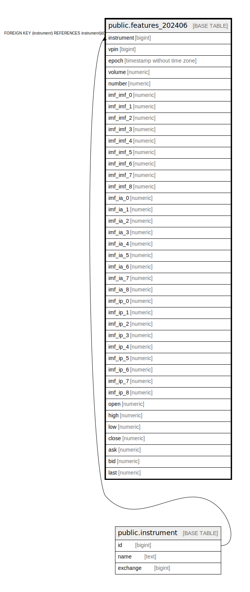

# public.features_202406

## Description

## Columns

| Name | Type | Default | Nullable | Children | Parents | Comment |
| ---- | ---- | ------- | -------- | -------- | ------- | ------- |
| id | bigint | nextval('features_202406_id_seq'::regclass) | false |  |  |  |
| instrument | bigint |  | false |  | [public.instrument](public.instrument.md) |  |
| vpin | bigint |  | false |  | [public.vpin](public.vpin.md) |  |
| epoch | timestamp without time zone |  | false |  |  |  |
| volume | numeric |  | false |  |  |  |
| number | bigint |  | false |  |  |  |
| imf_imf_0 | numeric |  | true |  |  |  |
| imf_imf_1 | numeric |  | true |  |  |  |
| imf_imf_2 | numeric |  | true |  |  |  |
| imf_imf_3 | numeric |  | true |  |  |  |
| imf_imf_4 | numeric |  | true |  |  |  |
| imf_imf_5 | numeric |  | true |  |  |  |
| imf_imf_6 | numeric |  | true |  |  |  |
| imf_imf_7 | numeric |  | true |  |  |  |
| imf_imf_8 | numeric |  | true |  |  |  |
| imf_ia_0 | numeric |  | true |  |  |  |
| imf_ia_1 | numeric |  | true |  |  |  |
| imf_ia_2 | numeric |  | true |  |  |  |
| imf_ia_3 | numeric |  | true |  |  |  |
| imf_ia_4 | numeric |  | true |  |  |  |
| imf_ia_5 | numeric |  | true |  |  |  |
| imf_ia_6 | numeric |  | true |  |  |  |
| imf_ia_7 | numeric |  | true |  |  |  |
| imf_ia_8 | numeric |  | true |  |  |  |
| imf_ip_0 | numeric |  | true |  |  |  |
| imf_ip_1 | numeric |  | true |  |  |  |
| imf_ip_2 | numeric |  | true |  |  |  |
| imf_ip_3 | numeric |  | true |  |  |  |
| imf_ip_4 | numeric |  | true |  |  |  |
| imf_ip_5 | numeric |  | true |  |  |  |
| imf_ip_6 | numeric |  | true |  |  |  |
| imf_ip_7 | numeric |  | true |  |  |  |
| imf_ip_8 | numeric |  | true |  |  |  |
| open | numeric |  | true |  |  |  |
| high | numeric |  | true |  |  |  |
| low | numeric |  | true |  |  |  |
| close | numeric |  | true |  |  |  |
| ask | numeric |  | true |  |  |  |
| bid | numeric |  | true |  |  |  |
| last | numeric |  | true |  |  |  |

## Constraints

| Name | Type | Definition |
| ---- | ---- | ---------- |
| features_202406_instrument_fkey | FOREIGN KEY | FOREIGN KEY (instrument) REFERENCES instrument(id) |
| features_202406_vpin_fkey | FOREIGN KEY | FOREIGN KEY (vpin) REFERENCES vpin(id) |
| features_202406_pkey | PRIMARY KEY | PRIMARY KEY (instrument, vpin, epoch) |
| features_202406_id_key | UNIQUE | UNIQUE (id) |

## Indexes

| Name | Definition |
| ---- | ---------- |
| features_202406_pkey | CREATE UNIQUE INDEX features_202406_pkey ON public.features_202406 USING btree (instrument, vpin, epoch) |
| features_202406_id_key | CREATE UNIQUE INDEX features_202406_id_key ON public.features_202406 USING btree (id) |

## Relations

---

> Generated by [tbls](https://github.com/k1LoW/tbls)
