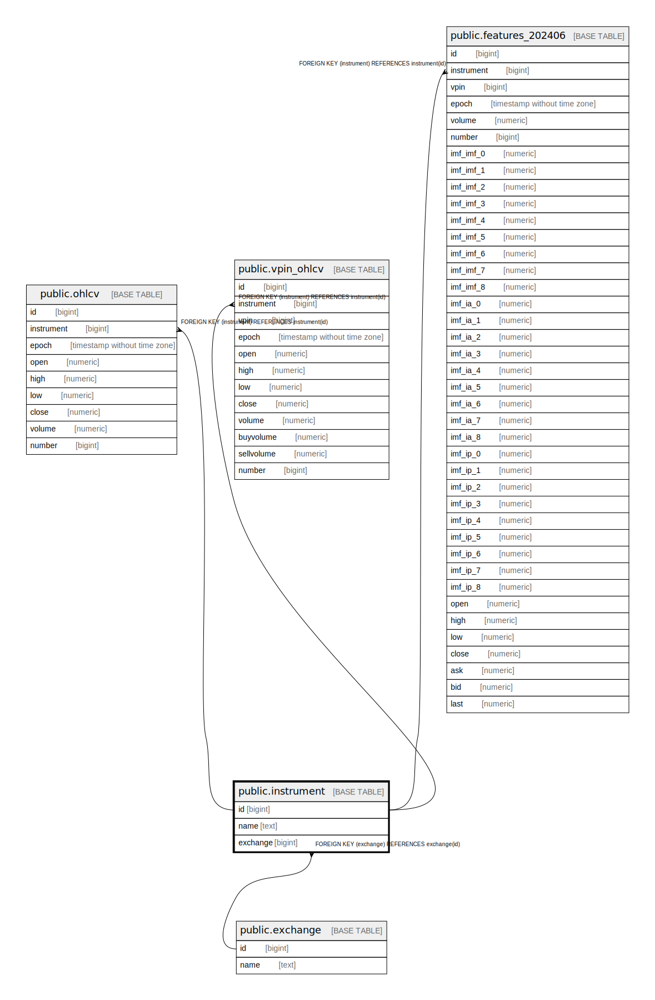

# public.instrument

## Description

## Columns

| Name | Type | Default | Nullable | Children | Parents | Comment |
| ---- | ---- | ------- | -------- | -------- | ------- | ------- |
| id | bigint | nextval('instrument_id_seq'::regclass) | false | [public.ohlcv](public.ohlcv.md) [public.vpin_ohlcv](public.vpin_ohlcv.md) [public.features_202406](public.features_202406.md) |  |  |
| name | text |  | false |  |  |  |
| exchange | bigint |  | false |  | [public.exchange](public.exchange.md) |  |

## Constraints

| Name | Type | Definition |
| ---- | ---- | ---------- |
| instrument_exchange_fkey | FOREIGN KEY | FOREIGN KEY (exchange) REFERENCES exchange(id) |
| instrument_pkey | PRIMARY KEY | PRIMARY KEY (id) |
| instrument_exchange_name_key | UNIQUE | UNIQUE (exchange, name) |

## Indexes

| Name | Definition |
| ---- | ---------- |
| instrument_pkey | CREATE UNIQUE INDEX instrument_pkey ON public.instrument USING btree (id) |
| instrument_exchange_name_key | CREATE UNIQUE INDEX instrument_exchange_name_key ON public.instrument USING btree (exchange, name) |

## Relations

---

> Generated by [tbls](https://github.com/k1LoW/tbls)
