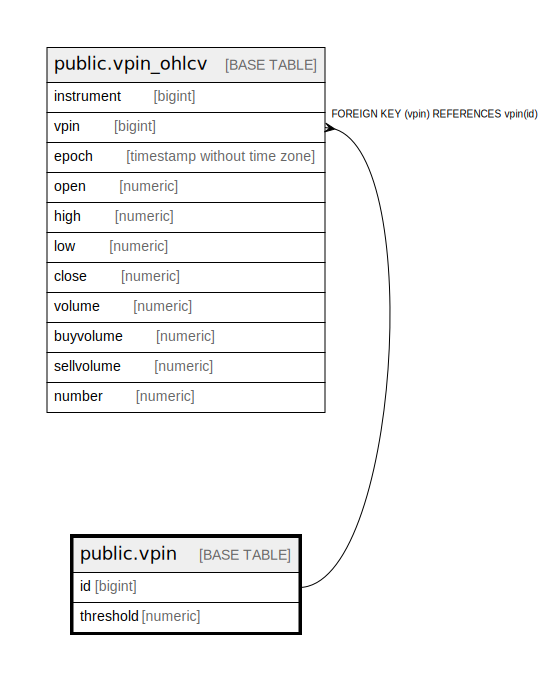

# public.vpin

## Description

## Columns

| Name | Type | Default | Nullable | Children | Parents | Comment |
| ---- | ---- | ------- | -------- | -------- | ------- | ------- |
| id | bigint | nextval('vpin_id_seq'::regclass) | false | [public.vpin_ohlcv](public.vpin_ohlcv.md) |  |  |
| threshold | numeric |  | false |  |  |  |

## Constraints

| Name | Type | Definition |
| ---- | ---- | ---------- |
| vpin_pkey | PRIMARY KEY | PRIMARY KEY (id) |

## Indexes

| Name | Definition |
| ---- | ---------- |
| vpin_pkey | CREATE UNIQUE INDEX vpin_pkey ON public.vpin USING btree (id) |

## Relations

---

> Generated by [tbls](https://github.com/k1LoW/tbls)
