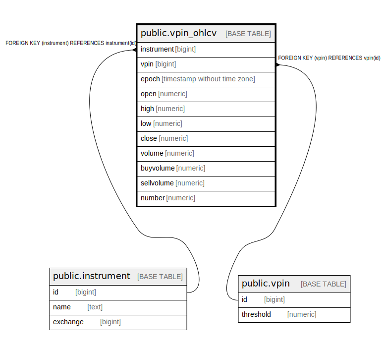

# public.vpin_ohlcv

## Description

## Columns

| Name | Type | Default | Nullable | Children | Parents | Comment |
| ---- | ---- | ------- | -------- | -------- | ------- | ------- |
| instrument | bigint |  | false |  | [public.instrument](public.instrument.md) |  |
| vpin | bigint |  | false |  | [public.vpin](public.vpin.md) |  |
| epoch | timestamp without time zone |  | false |  |  |  |
| open | numeric |  | true |  |  |  |
| high | numeric |  | true |  |  |  |
| low | numeric |  | true |  |  |  |
| close | numeric |  | true |  |  |  |
| volume | numeric |  | true |  |  |  |
| buyvolume | numeric |  | true |  |  |  |
| sellvolume | numeric |  | true |  |  |  |
| number | numeric |  | true |  |  |  |

## Constraints

| Name | Type | Definition |
| ---- | ---- | ---------- |
| vpin_ohlcv_instrument_fkey | FOREIGN KEY | FOREIGN KEY (instrument) REFERENCES instrument(id) |
| vpin_ohlcv_vpin_fkey | FOREIGN KEY | FOREIGN KEY (vpin) REFERENCES vpin(id) |
| vpin_ohlcv_pkey | PRIMARY KEY | PRIMARY KEY (instrument, vpin, epoch) |

## Indexes

| Name | Definition |
| ---- | ---------- |
| vpin_ohlcv_pkey | CREATE UNIQUE INDEX vpin_ohlcv_pkey ON public.vpin_ohlcv USING btree (instrument, vpin, epoch) |

## Relations

---

> Generated by [tbls](https://github.com/k1LoW/tbls)
